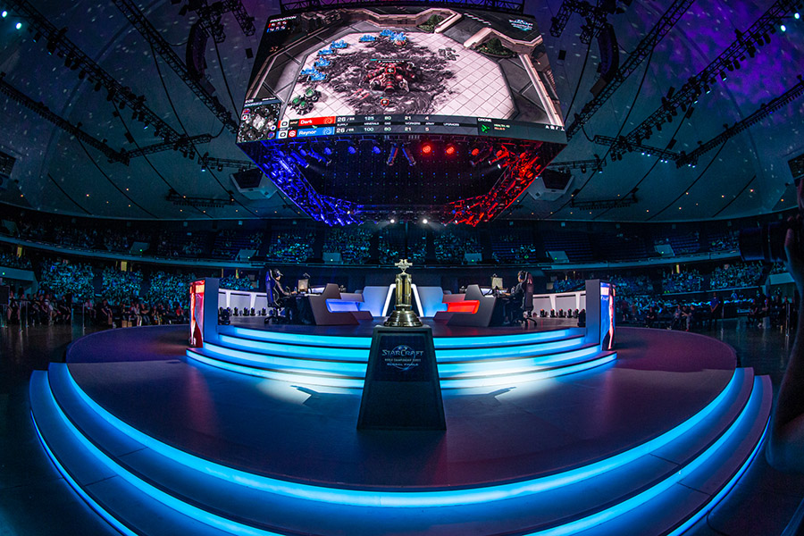

```{bash git,eval=FALSE  , include=FALSE}
cd ~/STAT757/skillcraft
git add --all
git commit -m "Confidence"
git push
```
```{r setup, include=FALSE}
knitr::opts_chunk$set(echo = TRUE)
```
```{r loading_packages,include=FALSE}
library(tidyverse)
library(dbplyr) #piping
library(ggplot2) #plotting
library(gridExtra)# easy plot grids
library(Hmisc) # for correlation matrix
library(corrplot) # For correlation matrix graphic
#library(SC2API) #starcraft 2 API
library(broom) #tidy lm summaries
library(knitr) #pretty tables
#library(GGally)  ggpairs

#library(knitr)#Side by side table
#library(kableExtra)#Side by side table
```
```{r settoken, include=FALSE}
#set_token("33be678eb46d4f51ac36f72218abcdd2", #"Sb3QWR8A9mN9s0XgAt5w4j0FttY84pkg")
```
```{r midterm2, include=FALSE}
# Assignment Midterm 2

#https://cgrudz.github.io/teaching/stat_757_2020_fall/assets/midterm_2.html
```
# Introduction
 
Videogames are one of my favorite past times. As a player who participates in ranked play, I've always kept my eye on the forefront of global competitions. One of the most notable games to establish a global competitive scene backed by paid professionals was the real-time strategy game (RTS) Starcraft II (SC2). In 2013 the top 10 starcraft players by earnings made nearly four-million dollars from their combined winnings @Winnings2019. Watching top-caliber players reflexes and control is astonishing to even seasoned videogame enthusiasts. At the 2019 StarCraft II World Championship Finale, many others and I packed into the arena to see what these professions could do firsthand.



The eye watering speeds they perform at is universally referenced in gaming terminology as actions per minute (APMS). Professionals take actions at such fastspeeds (high APMS) it becomes challenging to follow their overall strategy. So past pondering their sheer speed, I found it difficult to distinctly define what made these players professionals.

To learn more about what defines talent in SC2 this analysis we will explore in game metrics in attempts to explain rank in competitive mode. The dataset used was provided by ['@UCI'](https://archive.ics.uci.edu/ml/datasets/SkillCraft1+Master+Table+Dataset).

## Goal

To model the response LeagueIndex a sample of player data from a 2013 ranked season of Starcraft will be explored. The predictors provided summarize in game performance metrics for a season by player (GameID). The modeling process will consider all the predictor variables and then trim down until only significant predictors remain.  Variables will be vetted for multicolinearity and finally the model will be explored for to see if the BLUE assumptions hold.

## Limitations of the Model

The multivariate regression model used for the midterm 2 portions of this study explores the linear estimation of mean response of LeagueIndex estimated by predictors in the design matrix $X$. 

The assumptions of this model's explanatory power depends on the residual error being gaussian. Considering LeagueIndex is ordinal variable it is doubtful if not impossible for the residuals to be statistically normal.

A more suitable form of model for this regression would be based off a Polytonomous Logistic Regression for Ordinal Response (Proportional Odds Model) @OrdinalLog. These methods will be revisited for the final portion of this analysis.

# The Data Exploring

```{r loaddata , include=FALSE}
sc<-read_csv("~/STAT757/skillcraft/SkillCraft1_Dataset.csv")
```

This dataset is a sample of averaged in-game metrics of Starcraft II players who participate in 2013 ranked play. The variables are as follows:
```{r,echo=FALSE}
colnames(sc)
```
The appendix covers each in depth but the following are highlighted as a preface.

**LeagueIndex** The levels of LeagueIndex range (1:8) corresponding to player ranks Bronze, Silver, Gold, Platinum, Diamond, Master, Grand Master, and Professional league. Game ranking systems frequently are based on ELO/MMR that varies over a much larger range typically ~1200-3000. These ranges are then masked with medal ranks as listed above and then further subdivided into divisions within each medal @Leagues2019 . Using either MMR or having the subdivisions of each player would provide some much needed continuity but unfortunately neither of these metrics are available. These limitation will be revisited more specifically along the exploration, modeling, and the predictions of the values.. The following are the icon's earned for players who achieve related rank by the end of a given season. The legends for the following plots are styled to match.

\center  \center

```{r colorvector, echo=FALSE}
cbPalette <- c("#CC6600", "#999999", "#FFCC00", "#CCCFFF", "#CCFFFF","#0072B2", "#FF6600")
```

**Actions Per Minute (APMs)** - APMs apply to variety of games but are common metric for analyzing proficiency of players at RTS games, its theorized skills like this provide a great advantage to players @APMDefiniton. Action quickness alone does not capture the strategy or macro/micro skills so these additional predictors may add some unique color in hopes of further explaining what makes players skilled.

**Perception Action Cycles (PACs)** - are the circular flow of information between an organism and its environment where a sensor-guided sequence of behaviors are iteratively followed towards a goal @Perception. In this data-set PACs are aggregate of screen movements where PAC is a screen fixation of containing at least one action @UCI.

# Cleanliness

```{r ,include=FALSE}
#set type
sc$HoursPerWeek<-as.numeric(sc$HoursPerWeek)
sc$TotalHours<-as.numeric(sc$TotalHours)

count_missing_age<-count(sc%>%
  filter(is.na(Age))%>%arrange(LeagueIndex))
count_professional<-count(sc%>%filter(LeagueIndex==8))
count_grandmaster<-count(sc%>%filter(LeagueIndex==8))
print(paste('There are ',count_missing_age,' missing values in the age column. There are ',count_professional,' professional #players.'))
```

The missing values are related exclusive to players with LeagueIndex equivalent to Professional Players (8). Where the `r count_professional` players with LeagueIndex==8 the age data is NA and the HoursPerWeek are 0. LeagueIndexes 1-7 are obtainable natural game play, to be a professional you would have to be part of a team. The study is aiming to understand how players go from being average to good, less so elite to best.The 55 values associated with professionals will be dropped to resolve both issues.

Another issue with **LeagueIndex** is that **LeagueIndex** 1-6 may contain any number of players, while **LeagueIndex** 7-Grandmaster may only contain some set range of players targeted at 1000 total per region @Leagues2019. Dropping **LeagueIndex** 7 would be a step towards normality.Considering this multivariate non-polylogistical model is already hampered by its selected application, **LeagueIndex**==7 will be kept to preserve a potential insight into the true population of Starcraft II players. 

In addition to the missing values we have a clear error with the **TotalHours** of one player. $GameID = 5140$ has 1,000,000 **TotalHours** that equates to 114 years of game time.

If we assumed one extra zeros was added the end of the player's **TotalHours** it equates to 14 years of played time on a game that is only 10 years old as of a 2020. Removing two zeros equates to 1.4 years of played time, and 3 zeros in `r .14*365` days of played time both that seems just as realistic. There is not a clear path to extrapolate this player's true **TotalHours** so their data will be dropped from the analysis. This was originally detected during modeling, but brought earlier into that analysis because how obviously unintentional this value is.

```{r,echo=FALSE}
sc<-filter(sc,sc$TotalHours<1000000)
```
Finally, preforming basic a inspection on **HoursPerWeek** a max value of 168 was discovered. Considering there are 168 hours in a week its not plausible for a individual player to do this. There could be multiple players using this account making this possible. Another prospect is that this player is actually an AI like google's DeepMind @AlphaStar. Either way this observation will be kept because what is realistic cutoff for the hours per week is not apparent and after removing the observation the next max value is 140 which seems almost as unrealistic.

Its worth noting that dropping any amount of high hour outliers still far from combats all the issues encountered through the use of **HoursPerWeek** and **TotalHours**. Multiple players could be using any of the accounts even either variable is not relatively high.  Potentially exacerbating the left-extrema is that nothing prevents one player from smurfing. Smurfing is when a player makes a additional accounts @Smurf. A common reason for doing this is to dominate the competition until their rating adapts to their skill level.

```{r finalclean, include=FALSE ,echo=FALSE}
sc<-sc%>%
  drop_na()%>%
  filter(HoursPerWeek!=0)
sc_describe<-describe(sc)
```

## Converting Units
Some of the time averaged metrics are per SC2 timestamp while other are per milisecond. To make these metrics more interpretable each metric will be converted into seconds. There are roughly 88.5 timestamps per second so each metric in timestamps will be multiplied that as a coefficient  @UCI. Some of the time averaged metrics are per milisecond. These will be transformed into seconds so the time units are completely uniform. Both of these transformations are linear and will not affect our model's assumptions.
```{r changeunits, include=FALSE}
sc<-sc%>%
  mutate(NumberOfPACs=NumberOfPACs*88.5,
         MinimapAttacks=MinimapAttacks*88.5,
         MinimapRightClicks=MinimapRightClicks*88.5,
         SelectByHotkeys=SelectByHotkeys*88.5,
         AssignToHotkeys=AssignToHotkeys*88.5,
         UniqueHotkeys=UniqueHotkeys*88.5,
         WorkersMade=WorkersMade*88.5,
         UniqueUnitsMade=UniqueUnitsMade*88.5,
         ComplexUnitsMade=ComplexUnitsMade*88.5,
         ComplexAbilitiesUsed=ComplexAbilitiesUsed*88.5,
         GapBetweenPACs=GapBetweenPACs*1000,
         ActionLatency=ActionLatency*1000)
```


```{r statsatlevels, include=FALSE}
#sc$LeagueIndex <- as.factor(sc$LeagueIndex)
#ggplot(sc, aes(x=LeagueIndex, y=ActionsInPAC)) + 
#  geom_boxplot()
#lm(LeagueIndex~APM,sc)
```

## Summary Statistics and Plots

```{r, echo=FALSE}
#summary(sc)
```
### Gaussianity of the Response

When using Shapiro-Wilk W test on response **LeagueIndex** the null hypothesis that the samplecomes from normally distribution can be rejected. Besides the obvious issues with performing a W test with an ordinal response, the response has a heavy tail with a mean of `r round(mean(sc$LeagueIndex),2)`. Additionally we cannot assume the levels between LeagueIndexes are uniforming spaced. As previously mentioned **LeagueIndex** like Grandmaster are capped typically prevents LeagueIndex 1-7 from having a gaussian distribution.

```{r, echo=FALSE}
LeagueIndex_Normal<-shapiro.test(sc$LeagueIndex)
  
ggplot(sc)+
  geom_histogram(aes(x=LeagueIndex,y=(..count..)/sum(..count..),fill=LeagueIndex),
      position = "identity", binwidth = 1,fill=cbPalette) +
  ylab("Relative Frequency")+
  ggtitle('LeagueIndex Distribution',subtitle = paste(LeagueIndex_Normal[3],
      " P-Value: ",LeagueIndex_Normal[2]))+xlab("LeagueIndex 1-Bronze to 7-Grandmaster")

```

### Correlation Plot

Visually we can see that LeagueIndex has a relatively strong correlation with **APM, SelectByHotkeys, AssignToHotkeys, NumberofPACs, GapBetweenPACs, and Action Latency**. Some of these predictors may be the best choices for model, although its worth noting at this point many of the predictor values also have fairly strong correlations within themselves which may cause multiplecolinearity in a model. This is not too surprising because many of these metrics capture rate of actions in slightly difference forms. For example **APM** and **NumberOfPacs** likely have a strict mathematical relationship where approximately. $$NumberOfPACs \approx APM*MatchDurationMinutes$$ The slight differences between these metrics them could have some deep explanatory power but that level of explore ration is beyond the scope of this analysis.

The following columns will be dropped because plausible confoundance with **APMs, ActionLatency, GapBetweenPACs** ^[An additional issues with this predictor is that it does not seem to line up with the time units in the description. Before and after the unit transformation **GapBetweenPACs** results in a mean is `r round(mean(sc$GapBetweenPACs))/60^2` hours.)]**, NumberofPACS, SelectbyHotkey, and ActionsInPAC.**

Focusing exclusively on **APM** fits into an Occam's razor approach by minimizing $span(X)$.

```{r echo=FALSE}
sc_cor<-cor(select_if(sc,is.numeric),use = "complete.obs")
sc_cor_plot<-corrplot(sc_cor,
    tl.cex=.75,
    tl.col='black')
```
```{r droppredictorsandredocor, echo=FALSE}
sc<-sc%>%select(!c(GameID,ActionLatency,GapBetweenPACs,NumberOfPACs,SelectByHotkeys,ActionsInPAC))
```
 
### Visual Relations

```{r,include=FALSE}
cor_hoursperweek<-paste(
  round(cor(sc%>%filter(between(LeagueIndex,1,4))%>%select(LeagueIndex),
    sc%>%filter(between(LeagueIndex,1,4))%>%select(HoursPerWeek))[1],
    2),
  "vs",
  round(cor(sc%>%filter(between(LeagueIndex,4,7))%>%select(LeagueIndex),
    sc%>%filter(between(LeagueIndex,4,7))%>%select(HoursPerWeek))[1],
    2)
)
```

Visually determining trends between the predictors and the response with a ordinal response is is best done with alternatives to scatter plots. Violinplots will be used to gauge the linearity in relation to the response and distribution with variable at the varying levels @ViolinPlots. 

**MinimapAttacks, HoursPerweek, TotalHours, MinimapRightClicks, ComplexUnitsMade, ComplexAbilitiesUsed** all have very long right tails. In search of gaussian predictors the listed variables were considered transformations, but this would have affect the affected the simplicity of the explanation.^[A log transformation would be preferable, but enough observations by GameID that contain at least 0 in the related predictor entry a  would have to drop observation containing $-\infty$. If a transformation is persued for the second-half of this analysis it will likely be a square root transformation]

#### No Relationship
**Age** the mean age of `r mean(sc$Age)` does not vary much across **LeaguIndex** such that there is no stark linear relationship. Although the variance at the highest level seems to be much narrower then that at the lower levels. 

#### Bimodal
**HourPerWeek** has visibly little or no relation to LeagueIndex 1-4 where LeagueIndex 4-7 seems to have a visible linear trend resulting in `r cor_hoursperweek`. If HoursPerWeek survives the model trimming, it's bimodality may cause issues with the model's assumption $COV(Y)=\sigma^2I$.**Workersmade,ComplexUnitsMades, and ComplexAbilityUsed** both have similar differences between LeagueIndex 1-4 and 4-7 with the portions that have no relation and a linear relation swapped in comparison to HoursPerWeek. 

#### Linear

**TotalHours, MinimapRightClicks, TotalMapExplored, and UniiqueUnitsMade** have a positive linear trend with the response. **APM** has a strong linear relationship with the response. 

#### Root
**AssignToHotkeys, UniqueHotkeys, and MinimapAttacks** have a notable square root relationship with the response. This also may cause issues with the Gaussianity of the model's residuals.

```{r transform, echo=FALSE}
#sc[,c("MinimapAttacks", "HoursPerWeek","TotalHours","MinimapRightClicks"
#      ,"ComplexUnitsMade","ComplexAbilitiesUsed")]<-sqrt(sc[,c("MinimapAttacks", "HoursPerWeek","TotalHours","MinimapRightClicks"
#      ,"ComplexUnitsMade","ComplexAbilitiesUsed")])
```


```{r,echo=FALSE,error=FALSE, compact=TRUE}
VioLeagueIndex<-function(predictor){
  ggplot(sc, aes(x=factor(LeagueIndex), y=unlist(sc%>%select(all_of(predictor))), fill=factor(LeagueIndex))) + 
    geom_violin(trim=FALSE, color="black")+scale_fill_manual(values=cbPalette)+
    stat_summary(fun.data=mean_sdl,geom="pointrange", color="black")+ coord_flip()+
    ggtitle(paste("LeagueIndex by",predictor))+
    xlab("LeagueIndex")+ylab(predictor) + guides(fill= FALSE)
    }

plots<-lapply(colnames(sc)[2:length(colnames(sc))],VioLeagueIndex)

do.call("grid.arrange", c(plots[1:4], ncol=2))
do.call("grid.arrange", c(plots[5:8], ncol=2))
do.call("grid.arrange", c(plots[9:13], ncol=2))
```
# Model Specifications

```{r exhaustivestepwise,echo=FALSE,collapse=TRUE}

## Stepwise Linear Regression:

#The function summary() reports the best set of variables for each model size. From the output above, an asterisk #specifies that a given variable is included in the corresponding model @Stepwise.


#library(caret) #for easy machine learning workflow
#library(leaps) #for computing stepwise regression

#sc_lm_sw_back<-regsubsets(LeagueIndex~., sc, nvmax = 5,
#                     method = "exhaust",force.in = NULL,force.out = NULL)

#sc_lm_sw_back_summary<-summary(sc_lm_sw_back)
#using the lm provivded 
#sc_lm_r1<-lm(LeagueIndex~ActionLatency+AssignToHotkeys+APM+MinimapAttacks,sc)
#summary(sc_lm_r1,cor=T)

#Normality
#qqnorm(residuals(sc_lm_r1))
#shapiro.test(residuals(sc_lm_r1))
```

## Manual Regression Iterations

```{r,echo=FALSE}
sc_lm<-lm(LeagueIndex~.,sc)
sc_lm_1<-update(sc_lm,.~.-UniqueUnitsMade ,sc)
sc_lm_2<-update(sc_lm,.~.-Age-UniqueUnitsMade)
sc_lm_3<-update(sc_lm,.~.-Age-UniqueUnitsMade-ComplexUnitsMade)
sc_lm_4<-update(sc_lm,.~.-Age-UniqueUnitsMade-ComplexUnitsMade-MinimapRightClicks)
sc_lm_final<-update(sc_lm,.~.-Age-TotalMapExplored-UniqueUnitsMade-MinimapRightClicks-ComplexUnitsMade)

#anova(sc_lm_1)$'Pr(>F)'
```

```{r,echo=FALSE}
sc_lm<-lm(LeagueIndex~.,sc)
sc_lm_1<-update(sc_lm,.~.-UniqueUnitsMade ,sc)
sc_lm_2<-update(sc_lm,.~.-Age-UniqueUnitsMade)
sc_lm_3<-update(sc_lm,.~.-Age-UniqueUnitsMade-ComplexUnitsMade)
sc_lm_4<-update(sc_lm,.~.-Age-UniqueUnitsMade-ComplexUnitsMade-MinimapRightClicks)
sc_lm_final<-update(sc_lm,.~.-Age-TotalMapExplored-UniqueUnitsMade-MinimapRightClicks-ComplexUnitsMade)

```

Before beginning diagnostic tests, a model with all predictors will be made. Subsequently predictors will be dropped one by one until only predictors with significance of at least $\alpha=5\%$ remain starting with $lm_\Omega$ and end with $lm_\omega$. The results are as follows:

The all inclusive model summary:
```{r, echo=FALSE,compact=FALSE}
kable(tidy(sc_lm,conf.level = .05),digits = c(3,4,4,1),caption = "Summary of Starting Manual Stepwise Backward Model Selection$lm_\\Omega$")
```
After 4 iterations the all predictors were significant. The final iteration provided:
```{r, echo=FALSE}
kable(tidy(sc_lm_final,conf.level = .05),digits = c(3,4,4,1),caption = "Summary of Final Manual Stepwise Backward Model Selection$lm_\\omega$")
```
### Assessing Fit and Overall Significance

Our null model $H_o$ is there is no systematic structure to the response LeagueIndex. Our alternative $H_a$ is there is some relation such that $LeagueIndex=X\beta+\epsilon$, where X all other variables with the exception of index GameID. Without much surprise using `r length(colnames(sc))-1` predictor variables results of a very small p-value of ~`r glance(sc_lm)$p.value `. Over the iteration this does not change in a notable fashion across the 9 other models as the last model also results in a p-value`r glance(sc_lm_4)$p.value`. Thus all iterations of the model we can reject the null hypothesis suggesting that we should further investigate the explanatory power of our alternative hypothesis. 

```{r, include=FALSE, compact=TRUE}
### Noramlity of Residuals Both Models
#plot(sc_lm_4)
#plot(sc_lm_final)
```

## Testing for Signifance Between Models

If both models have normal residuals a F-test is used to determine if the the starting and final model's have significantly different residuals. The starting and ending models have Shapiro-Wilk's test results that reject the null at $\alpha=1\%$ shown in a later section that examines the normality, so these results will just by a exercise tossing aside that requirement. The $H_o$ specifically is that $RSS_{lm1}$ = $RSS_{lm4}$ and $H_a$ is that $RSS_{lm1}$ \neq $RSS_{lmfinal}$. Performing an ANOVA test we find that there is not significant difference in the models at $\alpha=5\%$ such that we cannot reject the $H_o$.(ANOVA see table below). Additionally their $adjR^2$ is barely different. $adjR^2$ starting at `r round(summary(sc_lm)[["adj.r.squared"]],2)` and ending at `r round(summary(sc_lm_final)[["adj.r.squared"]],2)`.

```{r,echo=FALSE, compact=TRUE}
kable(anova(sc_lm,sc_lm_final))
```
Confidence Intervals Table^[Delta values are normalized by dividing by the mean of the model by related predictors confidence interval]
```{r,echo=FALSE}
#t<-data.frame(confint(sc_lm),confint(sc_lm_final))
t1 <- data.frame(confint(sc_lm))
t2 <- data.frame(confint(sc_lm_final))
t3<-merge(t1,t2,by="row.names",all=TRUE)
t3<-t3%>%rename(LL_s=X2.5...x,UL_s=X97.5...x,LL_f=X2.5...y,UL_f=X97.5...y)
t3<-t3%>%mutate(mean_s=(UL_s+LL_s)/2,
                mean_f=(UL_f+LL_f)/2,
                delta=(mean_f-mean_s)/mean_f,
                delta_width=((UL_f-LL_f)-(UL_s-LL_s))/mean_f)%>%
         mutate_if(is.numeric, ~round(., 3))
kable(t3,format = "markdown", digits = c(4,4,4,4,4,4,4,2,2), caption="Confidence Intervals Statistics at $\\alpha$ 0.05" )
```

### Exploring the chosen model

Evaluate the goodness of fit of the model in terms of R2 and the standard errors, and the major sources of uncertainty. This includes parameter uncertainty, as well as structural uncertainty in the model. 

```{r, compact=TRUE,collapse=TRUE,echo=FALSE}

#summary(sc_lm_4)
#plot(sc_lm_4)
```
### Model Analysis Reform (Trim and then confound)

Describe your model, how you arrived at it, its goodness of fit, its significance versus other choices of models, and its uncertainty. Describe the predictive power, and the uncertainty. Include relevant tables and figures.

## Predict

Evaluate the predictive power of the model – particularly, how effective does the model appear to be at making predictions of future observations or the mean response. How might these predictions be unreliable? What are the limits of the prediction power, and where do we fall into extrapolation? 

## Prelude to final

*7 Describe your proposed research question for the final. How will you revise your original research question? What issues have you encountered so far? What assumptions do you think you need to (re-)evaluate? *

For the final, the logistical regression will remodel the same problem with a different set of techniques and assumptions that fit the ordinal response.

The goal is for the analysis pull in additional regression techniques while still integrating the previous exploratory exercises.

```{r, eval=FALSE,include=FALSE,include = FALSE}
data <-get_league_data(season_id = 43, 
                        queue_id = 201, 
                        team_type = 0, 
                        league_id = 3, 
                        host_region = "eu")
ladder_id <- data$tier$division[[1]]$ladder_id

for (i in ladder_id){
counter<-0
  if (counter==0){
    headsc <- get_ladder_data(ladder_id = i, host_region = "eu")
    counter<-counter+1}
  else{
    headsc<-rbind(headsc,get_ladder_data(ladder_id = i, host_region = "eu"))
  }
  }
#ladder_data <- get_ladder_data(ladder_id = ladder_id, host_region = "eu")
```

# Appendix

### About Columns
Attribute Information:

1. GameID: Unique ID number for each game (integer)
2. LeagueIndex: Bronze, Silver, Gold, Platinum, Diamond, Master, GrandMaster, and Professional leagues coded 1-8 (Ordinal)
3. Age: Age of each player (integer)
4. HoursPerWeek: Reported hours spent playing per week (integer)
5. TotalHours: Reported total hours spent playing (integer)
6. APM: Action per minute (continuous)
7. SelectByHotkeys: Number of unit or building selections made using hotkeys per timestamp (continuous)
8. AssignToHotkeys: Number of units or buildings assigned to hotkeys per timestamp (continuous)
9. UniqueHotkeys: Number of unique hotkeys used per timestamp (continuous)
10. MinimapAttacks: Number of attack actions on minimap per timestamp (continuous)
11. MinimapRightClicks: number of right-clicks on minimap per timestamp (continuous)
12. NumberOfPACs: Number of PACs per timestamp (continuous)
13. GapBetweenPACs: Mean duration in milliseconds between PACs (continuous)
14. ActionLatency: Mean latency from the onset of a PACs to their first action in milliseconds (continuous)
15. ActionsInPAC: Mean number of actions within each PAC (continuous)
16. TotalMapExplored: The number of 24x24 game coordinate grids viewed by the player per timestamp (continuous)
17. WorkersMade: Number of SCVs, drones, and probes trained per timestamp (continuous)
18. UniqueUnitsMade: Unique unites made per timestamp (continuous)
19. ComplexUnitsMade: Number of ghosts, infestors, and high templars trained per timestamp (continuous)
20. ComplexAbilitiesUsed: Abilities requiring specific targeting instructions used per timestamp (continuous)

### Why Violin Plots.

I decided to use Violin plots because I found with less tweaking they provided almost all the information I was looking for compared to scatter plots. Head to head a limitation of violin plots is that make it seems as though the LeagueIndex level size contains the same $n$. The histogram earlier in this analysis shows clearly that $n$ at each level of the **LeagueIndex** is not equal so choosing a tool on the basis of reiterating that point seems redundant. The benefit of Violin plots is that they provide a smoothed density plot at each **LeagueIndex** with a single point that represents the mean. This same thing could be done with scatter plots but I found it took much more staring and plot to plot variation.

The following is some head to head varieties plotting the data.
```{r, echo=FALSE}
p1<-ggplot(sc,aes(x=APM,y=LeagueIndex))+ geom_point( alpha = 0.1, size = 3)+scale_fill_manual(values=cbPalette)
p2<-ggplot(sc,aes(x=APM,y=LeagueIndex, fill=factor(LeagueIndex)))+ geom_jitter(shape=21, alpha = 0.1, size = 3)+scale_fill_manual(values=cbPalette)
p3<-ggplot(sc,aes(x=APM,y=LeagueIndex))+ geom_jitter(alpha = 0.1, size = 3)
p4<-VioLeagueIndex("APM")

grid.arrange(p1,p2,p3,p4,ncol=2)
p1<-ggplot(sc,aes(x=Age,y=LeagueIndex))+ geom_point( alpha = 0.1, size = 3)+scale_fill_manual(values=cbPalette)
p2<-ggplot(sc,aes(x=Age,y=LeagueIndex, fill=factor(LeagueIndex)))+ geom_jitter(shape=21, alpha = 0.1, size = 3)+scale_fill_manual(values=cbPalette)
p3<-ggplot(sc,aes(x=Age,y=LeagueIndex))+ geom_jitter(alpha = 0.1, size = 3)
p4<-VioLeagueIndex("Age")

grid.arrange(p1,p2,p3,p4,ncol=2)
```

# References